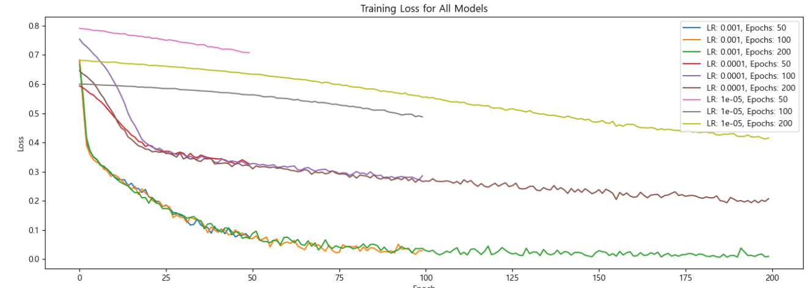
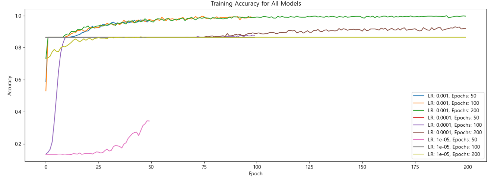
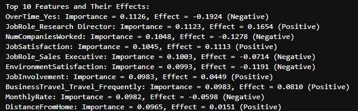
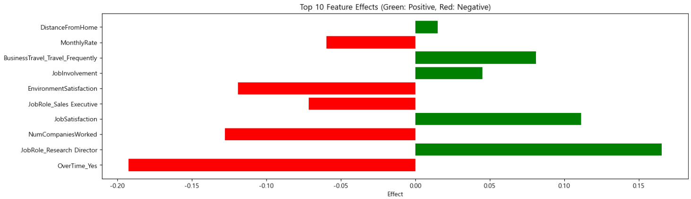

# SKN06-2nd-7Team
<div align="center">

</div>

# 사내 직원 이탈 예측 시스템 📑
> **SK Networks AI CAMP 6기** <br/> **개발기간: 2024.11.13 ~ 2024.11.14 (총 2일)** <br/> **팀명: 찢김✂️**

<br>

<hr>

<br>

### 개발팀 👩‍💻👨‍💻
| 조하늘 팀장 | 정지원 팀원 | 정민준 팀원 | 김지영 팀원 |
|:----------:|:----------:|:----------:|:----------:|
|   |   |  | |
| [@Haneul-Jo7](https://github.com/Haneul-Jo7) | [@giana-jw](https://github.com/giana-jw) | [@samking1234-Apple](https://github.com/samking1234-Apple) | [@yeong-ee](https://github.com/yeong-ee) |
| 전처리, DL | DL, streamlit | 전처리, ML, git관리 | EDA, 전처리, ML |

<br>

<hr>

<br>

### 프로젝트 개요 🪄
이 프로젝트는 직원의 이탈 여부를 예측하는 머신러닝 모델입니다. 인재 유지는 기업 운영에 있어 중요한 과제 중 하나입니다. 직원의 이탈(Attrition)은 조직의 생산성과 안정성에 영향을 미치며, 높은 이탈률은 기업 운영에 큰 비용을 초래할 수 있습니다. 따라서 직원의 이탈 가능성을 예측하여 사전 대책을 마련하는 것이 필요합니다. 해당 모델의 구축을 통해 기업이 이탈 가능성이 높은 직원들을 식별하고, 사전에 적절한 조치를 취할 수 있도록 도움을 주고자 합니다. 본 프로젝트는 기업이 이탈 가능성이 높은 직원들을 사전에 파악하여, 보다 효과적인 인력 관리 전략을 세우는 데 기여할 것입니다.

### 서비스 목표 📱
- 조기 퇴사 방지: 퇴사 가능성이 높은 직원 식별 및 조기 대응.
- 비용 절감: 채용 및 교육 비용 절감.
- 조직 건강 관리: 이직 패턴을 통해 인사 전략 개선.
- 데이터 기반 의사 결정: 객관적 인사 관리 지원.

<br>

<hr>

<br>

## 00. 시작 가이드
- 오류 메시지 관리
```bash
import warnings
warnings.filterwarnings(action='ignore')
```
- import libraries
```bash
# sklearn modules for machine learning
import pandas as pd
import numpy as np
from sklearn.model_selection import train_test_split, GridSearchCV, cross_val_score
from sklearn.preprocessing import StandardScaler, LabelEncoder
from sklearn.linear_model import LogisticRegression
from sklearn.ensemble import GradientBoostingClassifier, RandomForestClassifier
from sklearn.neighbors import KNeighborsClassifier
from xgboost import XGBClassifier
from sklearn.metrics import accuracy_score, classification_report
import joblib
from imblearn.over_sampling import SMOTE
import seaborn as sns
from scipy.stats import chi2_contingency
# sklearn modules for deep learning
import pandas as pd
import numpy as np
import torch
import torch.nn as nn
import torch.optim as optim
from sklearn.model_selection import train_test_split
from sklearn.preprocessing import StandardScaler
from sklearn.metrics import accuracy_score, classification_report
import matplotlib.pyplot as plt
```
<br>

<hr>

<br>

## 01. 데이터 전처리 결과서

### 1-1. 탐색적 데이터 분석(Exploratory Data Analysis, EDA) 수행 결과
- Dataset: [IBM HR Dataset](https://www.kaggle.com/datasets/mohamedhamdymady/ibmhr-dataset)
<br>
<br>
[Target data 분포 확인 - 직원 퇴사율] <br>

<br>
<br>
<br>
[수치형 변수, 범주형 변수에 대한 시각화] <br>


<br>
<br>
[Correlation Matrix Heatmap - 수치형 변수 상관관계 분석] <br>

<br>
<br>
[Chi-square Test - 범주형 변수와 attrition 간의 카이제곱 검정] <br>


### 1-2. 결측치 처리 방법 및 이유
- 결측치 확인
  - 결측치 없음
<div align="left">


<br>
<br>

### 1-3. 이상치 판정 기준과 처리 방법 및 이유
- 이상치 확인
  - 이상치 존재


- 이상치 판정 기준 <br>
: Box Plot을 통해 데이터의 분포를 시각화하고, 수염(whiskers) 바깥에 있는 점들을 이상치로 봄. 수염의 바깥에 위치한 값을 이상치로 판단.
<br>

- 이상치 처리 방법과 이유
  - MonthlyIncome ▶️ 로그 변환(급여분포정규화) <br>
  - NumCompaniesWorked, TrainingTimesLastYear, YearsinceLastPromotion, YearsWithCurrManager ▶️ IQR


<br>
<br>

  - 각 변수의 특성과 데이터의 분포를 고려. <br>
    1) MonthlyIncome(급여)은 일반적으로 양의 값만 가지며, 큰 편차를 가진 비대칭적인 분포를 보일 가능성이 높음. 따라서, 로그 변환으로 큰 값을 줄이고 작은 값의 분포를 늘려 데이터의 비대칭성을 완화하며, 이상치의 영향을 줄임. <br>
    2) IQR 방식은 변수의 분포가 정규분포가 아닐 경우에도 효과적으로 이상치를 탐지할 수 있으며, 중간 값을 기준으로 이상치를 판단하므로 데이터의 극단적인 값을 고려한 균형 있는 처리가 가능함. <br>
       ➡️ 각 변수의 분포 특성에 맞는 처리 방식을 적용함으로써, 모델이 더 좋은 일반화 성능을 가지도록 하기 위함.
<br>

### 1-4. Feature Engineering 방식
```bash
# YearsWithOtherCompanies: 다른 회사에서 근무한 연수
# TotalWorkingYears + YearsAtCompany
data_cleaned['YearsWithOtherCompanies'] = data_cleaned['TotalWorkingYears'] - data_cleaned['YearsAtCompany']
data_cleaned['YearsWithOtherCompanies'] = data_cleaned['YearsWithOtherCompanies'].apply(lambda x: max(x, 0))  # 음수 값은 0으로 처리

# AgeAtJoining: 입사 당시 나이
## Age + YearsAtCompany
data_cleaned['AgeAtJoining'] = data_cleaned['Age'] - data_cleaned['YearsAtCompany']
data_cleaned['AgeAtJoining'] = data_cleaned['AgeAtJoining'].apply(lambda x: max(x, 0))  # 음수 값은 0으로 처리

# IncomePerYearWorked: 연차당 소득
## MonthlyIncome_Log + TotalWorkingYears
data_cleaned['IncomePerYearWorked'] = data_cleaned['MonthlyIncome_Log'] / (data_cleaned['TotalWorkingYears'] + 1)  # +1을 더해 0으로 나누는 것을 방지

# 새로운 특성 확인
print("Columns after feature engineering:")
print(data_cleaned.columns)
```
1. YearsWithOtherCompanies: 다른 회사에서 근무한 연수
   - TotalWorkingYears  (총 근무 연수)에서 YearsAtCompany(현재 회사에서 근무한 연수)를 빼서 다른 회사에서 일한 기간을 계산
   - 결과 값이 음수일 경우 0으로 처리. (직원이 현재 회사가 첫 직장인 경우를 고려)
2. AgeAtJoining: 입사 당시 나이
   - Age(현재 나이)에서 YearsAtCompany(현재 회사에서 근무한 연수)를 빼서 입사 당시 나이를 계산
   - 결과 값이 음수일 경우 0으로 처리. (음수의 나이가 있을 수 없으므로)
3. IncomePerYearWorked: 연차당 소득
   - MonthlyIncome_Log(로그 변환된 월급)을 TotalWorkingYears + 1로 나누어 연차당 소득을 구함.
   - +1을 추가. (0으로 나누는 것을 방지)

<br>

<hr>

<br>

## 02. 모델 학습 결과서
### 2-1. 머신러닝 모델 학습 과정 및 튜닝
1. 변수 처리 및 분리
  - 모델을 구성하기 전에 범주형 변수를 변화하고 타겟 변수를 인코딩하는 작업을 수행함.

2. 모델 생성 및 학습
  - 1차적으로 랜덤 포레스트 모델을 이용해서 학습을 진행함.


3. 모델예측 및 평가
  - 과적합이 발생하지 않은 모델로 확인함.


4. 특성 중요도 확인
  - 상위 10개 특성의 중요도를 확인함.


5. 특성 중요도 시각화
  - 상위 10개 특성을 도표로 시각화함.


6. 모델 및 하이퍼파라미터 그리드 정의 (성능비교)
 - Logistic Regression, Random Forest, 'XGBoost 이 3가지 모델로 성능 비교를 결정.

7. 각 모델 그리드 서치 수행


8. 우수 모델 재학습 및 중요도 결과 산출
  - Logistic Regression이 가장 우수한 모델로 선정됨.

8-1) 재학습


8-2) 특성 중요도 재확인

 

 
8-3) 특성 중요도 시각화

 

 
9. 모델 저장

### 2-2. 딥러닝 모델 학습 과정 및 튜닝
1. 변수 처리 및 분리
  - 머신러닝 모델처리와 동일하게 처리함. 

2. 모델 생성 및 학습
  - 신경망 모델로 학습을 진행함. 모델명 Net.


3. 모델예측 및 평가
  - 초기 모델에 따른 평가 및 예측 진행. 


4. 특성 중요도 확인
  - 상위 10개 특성의 중요도를 확인함.


5. 특성 중요도 시각화
  - 상위 10개 특성을 도표로 시각화함.


6. 모델 및 하이퍼파라미터 그리드 정의 (성능비교)
 - lr = [0.001, 0.0001, 0.00001]
 - epochs = [50, 100, 200]
 - 위의 하이퍼파라미터를 통해 best_model 선정

7. 각 모델 그리드 서치 수행 <br>
 <br>


8. 우수 모델 재학습 및 중요도 결과 산출
  - lr = 0.0001, epochs = 200 인 모델이 가장 우수한 모델로 선정됨.

8-1) 우수 모델 학습 결과(train loss & accuracy)


8-2) 우수 모델 특성 중요도 재확인

 

 
8-3) 우수 모델 특성 중요도 시각화
- 해당 모델에서 중요하다고 판별된 특성들이 이직률에 긍정적인 영향을 끼치는지, 부정적인 영향을 끼치는지 확인.
 

 
9. 모델 저장
   
### 2-3. 모델 평가에 사용된 평가 지표 설명
- 본 문제는 이진 분류 문제로서 평가지표로 sklearn.metrics에 있는 classification_report를 활용함.
- precision, recall, f1-score 활용

  
### 2-4. 최종 선정 모델에 대한 설명
- 각 모델링 방법별 우수 모델을 최종 선정모델로 선택. 

<br>

<hr>

<br>

## 03. 학습된 모델 & Service application
### 최종 모델을 이용해 추론하는 application을 streamlit을 이용해 구현한 코드


## 마무리 회고
🐻 하늘: 저번 프로젝트보다 짧은 호흡으로 진행하다 보니, 더욱 빨리 진행되는 느낌이었습니다. 팀원분들이 각자 맡은 일을 책임감있게 진행해주셔서 한 수 배울 수 있는 시간이었습니다. 
프로젝트를 진행하면서는 데이터셋에 중요성을 계속해서 생각해보게 되었습니다. 좋은 데이터는 가치가 있다는 것을 알게 되었습니다. 
GPT모델이 많은 요즘, 양질의 데이터를 생산하는 것이 더욱 가치가 있을 수 있겠다는 생각을 하게 되었습니다. 실제로 데이터를 구할 때도 쓸만한 데이터는 다 금액을 요청한다는 것을 보고 더욱 절실히 느끼게 되었습니다. <br>
🐶 지원: 너무 어려워요 <br>
🦝 민준: 실제로 진행해보니 더 이해가 잘되는 시간이었던 것 같습니다. 자료조사부터 생각보다 힘들었지만 팀원들이 있어 든든했습니다! <br>
🐱 지영: EDA와 데이터 전처리부터 머신러닝, 딥러닝으로 시스템을 개발하는 흐름을 잘 파악할 수 있었던 프로젝트였습니다. 특히, EDA와 데이터 전처리에 있어 효과적인 처리 방법을 알아보고 적용하는 데 있어 복습할 수 있는 시간을 가질 수 있었습니다. 이번 프로젝트에서는 주로 데이터를 가공하는 데에 초점을 둔 역할을 맡았는데, 다음 프로젝트에서는 streamlit 앱을 구축하는 역할도 맡아보고 싶습니다!
